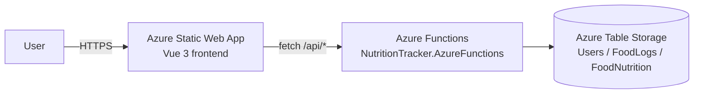

# CI/CD Pipeline & Free-Tier Hosting Plan (New `src/` Architecture)

This document describes how the **new hexagonal-architecture codebase** (`src/`, not `legacy/`) is built,
tested, and deployed to Azure automatically on every commit/push, and how it's hosted entirely on Azure
free-tier services.

## 1. Hosting Plan Summary

| Layer | Azure Service | Tier | Project |
|-------|--------------|------|---------|
| Frontend (web page) | **Azure Static Web Apps** | Free | `src/Presentation/NutritionTracker.Web` (Vue 3 + Vite) |
| Backend (API) | **Azure Functions** | Consumption (Y1) | `src/Adapters/Input/NutritionTracker.AzureFunctions` |
| Database | **Azure Table Storage** | Standard_LRS (pay-as-you-go, ~$0.05/mo) | `src/Adapters/Output/NutritionTracker.AzureTableStorage` |

There is no always-on compute and no SQL Database in this hosting plan — everything scales to zero when
idle, which is what makes it effectively free for a low-traffic personal project.

> The solution also contains a SQL Server-backed REST API adapter
> (`NutritionTracker.RestApi` + `NutritionTracker.SqlServer`) for local development, but it is **not**
> part of the Azure deployment target because SQL Database has no perpetual free tier.

### Estimated monthly cost

| Item | Free allowance | Cost beyond free tier |
|------|----------------|------------------------|
| Azure Functions (Consumption) | 1,000,000 executions + 400,000 GB-s/month | $0.20 / million executions |
| Azure Table Storage | 5 GB + 20K ops free for 12 months (new subscriptions) | ~$0.045/GB/month + $0.00036/10K ops |
| Azure Static Web Apps (Free SKU) | 100 GB bandwidth/month, unlimited apps | No paid tier needed for this project |
| **Total** | | **~$0.05 – $2.00/month** |

## 2. Architecture



The frontend calls the Function App directly over HTTPS (CORS-enabled); it is **not** integrated as a
managed SWA API, since the Functions app is deployed and versioned independently.

## 3. CI/CD Pipeline

All real GitHub Actions logic lives in `.github/workflows/` (GitHub requires reusable/runnable workflow
files to live there — see [deployment/GITHUB_ACTIONS_SAFETY.md](../deployment/GITHUB_ACTIONS_SAFETY.md)
for why the previous split into `deployment/pipelines/` didn't work).

| Workflow | Trigger | What it does |
|----------|---------|---------------|
| [build.yml](../.github/workflows/build.yml) | Push/PR to `main` | Restores, builds, and tests the whole `src/NutritionTracker.sln`; publishes a Functions artifact |
| [infrastructure.yml](../.github/workflows/infrastructure.yml) | Manual (`workflow_dispatch`, pick dev/staging/production), or auto when the infra script itself changes | Creates/updates the Resource Group, Storage Account, Function App, and Static Web App (idempotent — safe to re-run) |
| [deploy-backend.yml](../.github/workflows/deploy-backend.yml) | Push to `main` when backend/Core paths change | Builds, tests, publishes, and deploys the Azure Functions app |
| [deploy-frontend.yml](../.github/workflows/deploy-frontend.yml) | Push to `main` when frontend paths change; PRs get preview deploys | Builds the Vue app (`npm run build`) and deploys `dist/` to the Static Web App |

Azure DevOps equivalents exist under `deployment/pipelines/azure-devops-*.yml` for teams that prefer
Azure DevOps instead of GitHub Actions, and manual bash scripts exist under `deployment/scripts/` as a
fallback.

### Why infrastructure isn't fully "every push"

Re-creating/validating cloud resources on every single commit is wasteful and (for some Azure CLI
commands) not perfectly idempotent under heavy concurrency. Instead:
- **Build** runs on every push/PR (cheap, fast feedback).
- **Backend/Frontend deploy** run on every push to `main`, but only when their own folder changed
  (via `paths:` filters), so an API change doesn't redeploy the frontend and vice versa.
- **Infrastructure** stays on-demand (`workflow_dispatch`) by default, with an additional auto-trigger
  scoped only to changes in the infra script/workflow file itself — so editing the infra definition
  still deploys automatically, without recreating resources on unrelated code pushes.

## 4. One-Time Setup Checklist

1. **Create a service principal** for GitHub Actions to log into Azure:
   ```bash
   cd deployment/scripts
   ./create-service-principal.sh
   ```
   Add the JSON output as GitHub secret `AZURE_CREDENTIALS`.

2. **Run the "Deploy Infrastructure" workflow** manually (Actions tab → select `dev` → Run workflow).
   This creates the Resource Group, Storage Account, Function App, and Static Web App, and uploads two
   artifacts: `publish-profile` and `static-web-app-token`.

3. **Add the remaining secrets/variables** (Repository → Settings → Secrets and variables → Actions):

   | Name | Type | Source |
   |------|------|--------|
   | `AZURE_CREDENTIALS` | Secret | Step 1 output |
   | `AZURE_FUNCTIONAPP_PUBLISH_PROFILE` | Secret | `publish-profile` artifact from step 2 |
   | `AZURE_STATIC_WEB_APPS_API_TOKEN` | Secret | `static-web-app-token` artifact from step 2 |
   | `FUNCTION_APP_URL` | **Variable** | Function App URL from the step 2 job summary, e.g. `https://func-nutrition-tracker-dev.azurewebsites.net` |

4. **Push to `main`.** From now on:
   - Every push runs `build.yml`
   - Backend changes auto-deploy via `deploy-backend.yml`
   - Frontend changes auto-deploy via `deploy-frontend.yml`

5. **(Optional, recommended)** Once the Static Web App URL is known, tighten Function App CORS from
   `*` down to just that URL (see [deployment/AZURE_SETUP.md](../deployment/AZURE_SETUP.md#issue-cors-errors-from-frontend)).

## 5. Environments

The `dev` environment is what auto-deploys on every push to `main`. `staging`/`production` use the same
naming convention (`rg-nutrition-tracker-{env}`, `func-nutrition-tracker-{env}`,
`swa-nutrition-tracker-{env}`) and are only created when the Infrastructure workflow is run manually
with that environment selected — they aren't part of the automatic push-triggered flow.

## 6. Related Documentation

- [deployment/README.md](../deployment/README.md) — folder structure and platform support
- [deployment/ARCHITECTURE.md](../deployment/ARCHITECTURE.md) — why the pipeline is structured this way
- [deployment/AZURE_SETUP.md](../deployment/AZURE_SETUP.md) — detailed Azure CLI setup and troubleshooting
- [deployment/DEPLOYMENT.md](../deployment/DEPLOYMENT.md) — step-by-step deployment options
- [deployment/GITHUB_ACTIONS_SAFETY.md](../deployment/GITHUB_ACTIONS_SAFETY.md) — trigger behavior and secrets checklist
