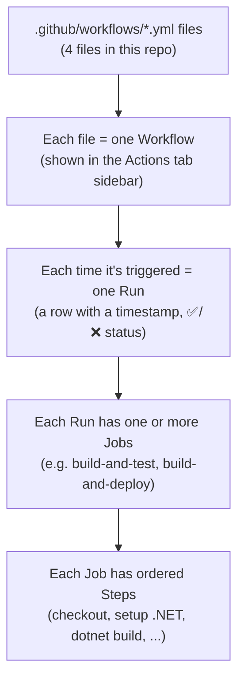

# GitHub Actions Basics: How Our `.github/workflows/` Files Map to the Actions Tab

You're seeing **4 items** in the GitHub **Actions** tab sidebar because there are exactly **4 YAML
files** in [.github/workflows/](../.github/workflows). GitHub Actions treats every `.yml` file in that
folder as one independent "workflow" and lists it by its `name:` field.

## The core concept: 1 file = 1 workflow = 1 row in the Actions sidebar



## The 4 workflows in this repo

| File | `name:` shown in Actions tab | What triggers it | What it does |
|------|-------------------------------|-------------------|---------------|
| [build.yml](../.github/workflows/build.yml) | **Build and Test** | Every push or PR to `main`, or manually | Restores, builds, and tests `src/NutritionTracker.sln`; publishes a Functions artifact |
| [deploy-backend.yml](../.github/workflows/deploy-backend.yml) | **Deploy Backend (Azure Functions)** | Push to `main` *only if* files under `src/Adapters/Input/NutritionTracker.AzureFunctions/`, `AzureTableStorage/`, `Persistence.Contracts/`, `Api.Contracts/`, or `src/Core/` changed | Builds, tests, publishes, and deploys the Azure Functions API |
| [deploy-frontend.yml](../.github/workflows/deploy-frontend.yml) | **Deploy Frontend (Static Web App)** | Push to `main` *only if* `src/Presentation/NutritionTracker.Web/` changed; PRs get a preview deploy | Builds the Vue app and deploys it to the Static Web App |
| [infrastructure.yml](../.github/workflows/infrastructure.yml) | **Deploy Infrastructure** | Manual only by default (`workflow_dispatch`, pick dev/staging/production); auto-runs only if the infra script itself changes | Creates/updates the Azure Resource Group, Storage Account, Function App, and Static Web App |

Each row's name comes straight from the `name:` line at the top of the file, for example:
```yaml
# .github/workflows/build.yml
name: Build and Test        # ← this string is what shows in the Actions sidebar
on:
  push:
    branches: [main]
  pull_request:
    branches: [main]
  workflow_dispatch:         # ← this adds the manual "Run workflow" button
```

## Reading a workflow file (using `infrastructure.yml` as the example)

```yaml
name: Deploy Infrastructure     # (1) Sidebar name

on:                              # (2) Triggers — when does this workflow run?
  workflow_dispatch:             #     "Run workflow" button, with a dropdown input
    inputs:
      environment:
        type: choice
        options: [dev, staging, production]
  push:                          #     ALSO runs automatically on push to main...
    branches: [main]
    paths:                       #     ...but only if these specific files changed
      - 'deployment/scripts/deploy-infrastructure.sh'
      - '.github/workflows/infrastructure.yml'

jobs:                            # (3) One or more jobs (each runs on its own VM)
  deploy-infrastructure:         #     Job ID (internal name)
    runs-on: ubuntu-latest       #     The VM image the job runs on
    steps:                       # (4) Ordered list of steps inside the job
      - name: Checkout code      #     Each step has a friendly name...
        uses: actions/checkout@v4 #    ...and either runs a reusable "action"...
      - name: Azure Login
        uses: azure/login@v2
        with:
          creds: ${{ secrets.AZURE_CREDENTIALS }}   # reads a secret you configured
      - name: Create Resource Group
        run: az group create ...  #    ...or runs raw shell commands (run:)
```

## What you'll see when you click into a workflow

- **Workflow page** (click "Build and Test" in the sidebar): a list of **runs**, newest first, each
  showing the commit message, branch, status (✅ success / ❌ failed / 🟡 in progress), and duration.
- **A single run**: shows the **job(s)** as boxes; click a job to see its **steps** streaming live logs.
- **Artifacts**: some runs (like Infrastructure) upload files at the end — e.g. `publish-profile` and
  `static-web-app-token` — downloadable from the bottom of that run's summary page.
- **Re-run**: any completed run can be re-run from the "..." menu, useful if something failed transiently.

## Why 4 separate files instead of 1 big one?

Splitting by concern keeps runs fast and focused:
- Editing only the frontend doesn't rebuild/redeploy the backend, and vice versa (via `paths:` filters)
- Infrastructure (which touches real Azure resources) is isolated from routine code pushes
- Each workflow's run history is easier to scan when it only reports on one concern

## Where the actual cloud work happens vs. just "triggers"

Everything above lives directly in `.github/workflows/` — there's no extra indirection layer. GitHub
requires runnable/reusable workflow files to be physically inside `.github/workflows/` (subfolders
aren't supported), which is why all the real logic (not just triggers) lives in these 4 files. See
[deployment/ARCHITECTURE.md](../deployment/ARCHITECTURE.md) for the history of why that matters here.

## Related docs

- [Docs/CICD-Pipeline-And-Hosting-Plan.md](CICD-Pipeline-And-Hosting-Plan.md) — full pipeline + hosting plan
- [deployment/GITHUB_ACTIONS_SAFETY.md](../deployment/GITHUB_ACTIONS_SAFETY.md) — trigger safety and required secrets
- [deployment/AZURE_SETUP.md](../deployment/AZURE_SETUP.md) — Azure-side setup steps
